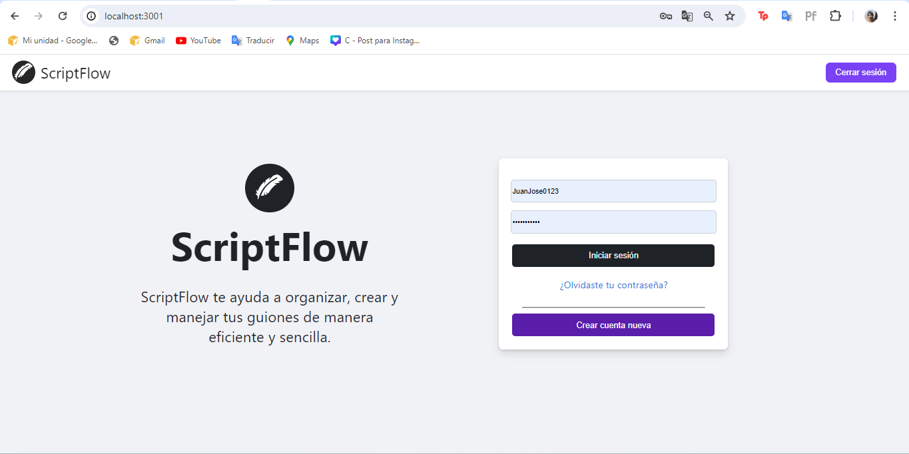
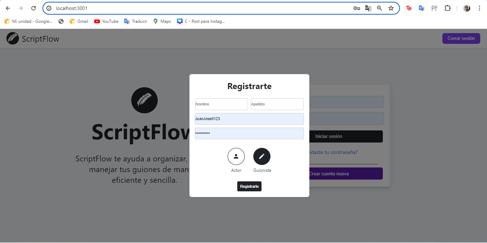
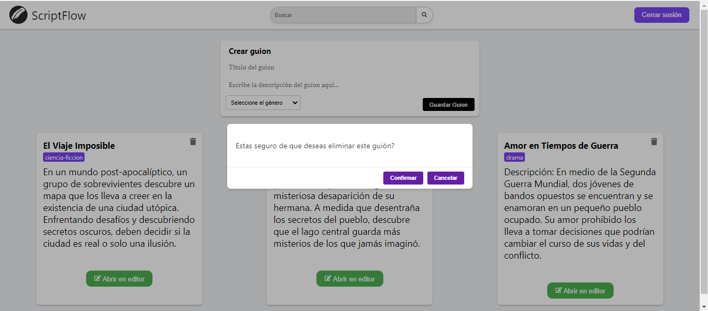
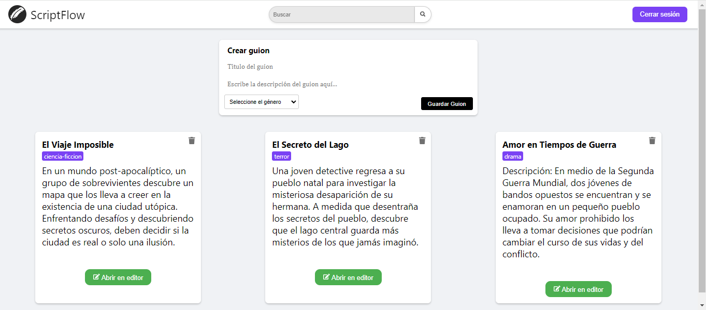
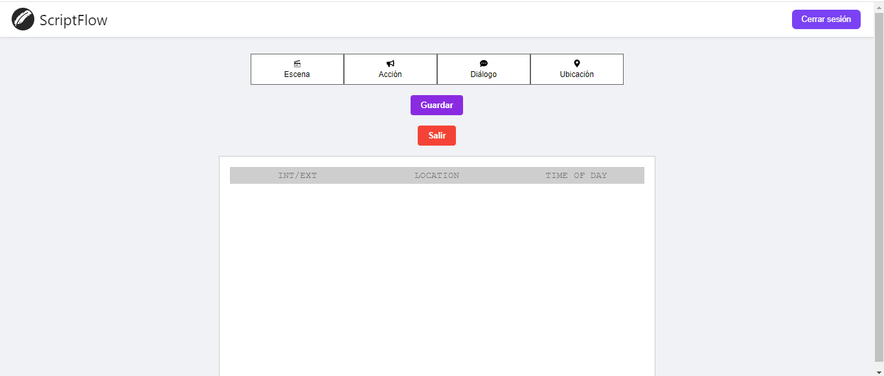
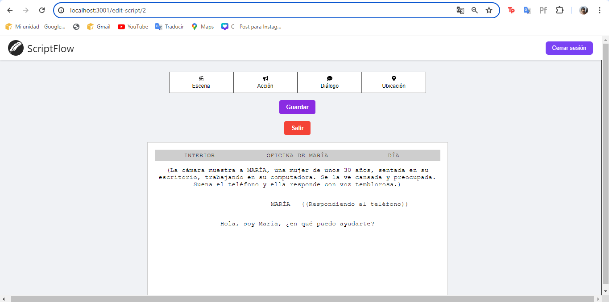

# Gestión de Guiones de Películas

Este proyecto es un software de gestión de guiones para equipos de producción de películas. Permite a los usuarios crear, almacenar, buscar y modificar guiones de manera eficiente. 

## Funcionalidades Principales

1. **Autenticación y Autorización**:
   - Registro de usuarios y inicio de sesión.
   - Sistema de roles: Guionistas (lectura y modificación) y usuarios regulares (solo lectura).

2. **Creación de Guiones**:
   - Herramientas de edición para crear y modificar guiones.
   - Guardado de guiones en la base de datos con título y género.

3. **Gestión de Guiones**:
   - Visualización y edición de guiones.
   - Historial de cambios para seguimiento de modificaciones.

4. **Atributos Específicos del Guion**:
   - **Ubicación de los Actores**: Coordenadas y rotaciones para la ubicación de actores en cada escena.
   - **Pose de los Actores**: Listado de poses o posiciones específicas de los actores en cada escena.
   - **Diálogos**: Almacenamiento de diálogos por personajes en cada escena.

## Tecnologías Utilizadas

- **Backend**: Express.js
  - **Entidades**:
    - `Dialog`
    - `Action`
    - `ActorLocation`
    - `Scene`
    - `Script`
    - `User`
  - **Servicios**:
    - Registro (`register`)
    - Inicio de sesión (`login`)
    - Verificación de roles de usuario

- **Frontend**: React.js
  - **Páginas**:
    - Login
    - Scriptboard (muestra los guiones creados por el guionista)
    - Editor (permite editar el guion actual)

- **Base de Datos**: PostgreSQL

## Instalación y Ejecución

### Backend (Express.js)

## Imágenes

### Página de Login

### ScriptBoard

### Editor de Guiones

